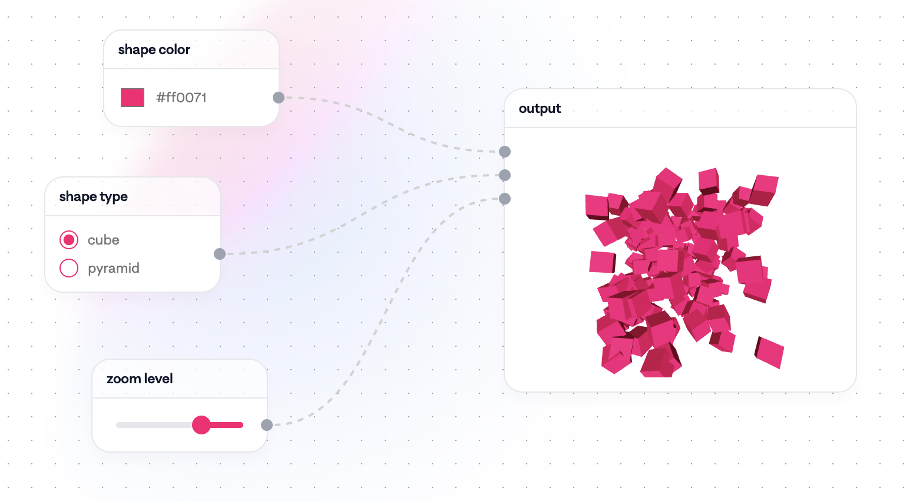

# 종합설계프로젝트2 아이디어 구체화 및 수행계획서 초안 구성

| 개요     | 내용                                            |
| -------- | ----------------------------------------------- |
| 회의주제 | 프로젝트 아이디어 구체화 및 수행 계획 초안 논의 |
| 일시     | 2025년 9월 9일, 오전 11시 12분                  |
| 참석자   | 고희연, 김대건, 박민진, 이지호, 이현서          |

## 주요 논의 내용

### 1. 서비스 방향성

-   멘토의 제안에 따라 일반인을 대상으로 한 서비스에 집중하기로 함.
-   기존의 [파이피(Pipy)](https://github.com/Catleap02/pipy-frontend) 서비스를 벤치마킹하여 사용자 친화적인 UI/UX를 구축하는 것에 동의함.
-   프로젝트 목표 및 타겟팅
    -   콘텐츠 크리에이터 및 ComfyUI 같은 전문 도구에 익숙하지 않은 사용자를 위한 사용자 친화적인 서비스를 개발하기로 확정함
    -   논문 주제는 R&D보다는 애플리케이션 개발에 집중하고, **인프라 부하 분산** 내용을 포함하여 작성하기로 했다.

### 2. 핵심 기능

1. 워크플로우 생성 `우선순위 상 🔴`

    - 사용자의 고품질 이미지 생성을 돕기 위해 프롬프트 입력 노드에 다양한 헬퍼 노드를 연결하는 방식을 채택했다.
    - 이 헬퍼 노드는 이미지 스타일, 핵심 주제, 세부 묘사, 카메라 및 기술 관련 용어 등을 설정할 수 있도록 구성된다.

> 좌측 노드를 이미지 생성시 도움을 줄 수 있는 헬퍼 노드 + 프롬프트 노드로 구성  
> 고퀄리티의 생성형 AI 결과물을 얻기 위해서는 `체계화된, 구체화된 프롬프트가 필요` 하다는 가정에 기반한 기능

2. 사용자별 화풍 학습 기능 `우선순위 중 🟠`

    - 사용자가 업로드하거나 생성한 20장 정도의 일러스트를 학습시켜, 사용자만의 화풍(Base Style)을 기억하고 이를 기반으로 완성된 일러스트를 생성하는 기능을 추가하기로 했다.

3. 워크플로우 버전 관리 `우선순위 중 🟠`

    - 변경사항마다 워크플로우의 스냅샷을 생성하여 저장하는 기능을 구현하기로 했다.

4. 사용자 및 인증인가 기능 `우선순위 하 🟡`

    - 우선은 단순 닉네임이나 ID를 사용하고, 추후 필요 시 기능을 보완하기로 했다.

5. 협업 실시간 블록 조립 `우선순위 하 🟡`

    - 기술적 난이도를 고려하여 우선순위에서 낮추고, 단일 사용자 기준으로 먼저 개발하기로 했다.

### 3. 기술 스택 (초안)

-   프론트엔드 : React, [ReactFlow](https://reactflow.dev/)
-   백엔드 : ComfyUI MCP 서버를 활용하여 백엔드와 프론트엔드 간의 통신을 처리하는 방안을 논의했다.
-   AI: LoRA나 ControlNet, IP-Adapter 등을 활용하여 사용자별 화풍 학습 기능을 구현한다.

## 결정 사항

-   프로젝트 아이디어: 콘텐츠 크리에이터를 위한 노드 기반 고품질 AI 이미지 생성 서비스를 개발한다.
-   논문/과제 방향: 애플리케이션 개발에 집중하고 `부하 분산 테스트 및 인프라 구축 내용`을 포함하여 논문의 완성도를 높이기로 한다.

## 향후 계획

-   팀 전체: 다음 주(9월 16일) 발표를 위한 발표 자료 작성.
-   고희연: 기존 Pipy 수행 계획서 및 PPT를 참고하여 배경 및 목표를 구체화를 돕는다.
-   이현서: AI 관련 구체적인 구현 방안을 이번 주 중으로 정리하여 공유.
-   팀 전체: 주말(금요일 또는 토요일)에 다시 모여 중간 점검 회의 진행.

## 다음 회의 안건

1. 직렬별 기술스택 정하기
2. 역할 분담 정하기
3. 회의 일정 정하기
4. 논문 주제 정하기
5. 일정계획 정하기 (마일스톤 및 간트차트)
6. 계획발표 PPT 만들기

## 참고자료

    

        고퀄리티 이미지 생성을 위해서 프롬프트에 꼭 들어갈 내용 (참고. Gemini)
    

    1. 이미지 스타일 및 기법

    -   시각적 스타일: 사진(photo), 일러스트레이션(illustration), 유화(oil painting), 수채화(watercolor), 3D 렌더링(3D rendering), 애니메이션(anime), 만화(comic book) 등 원하는 이미지의 전체적인 스타일을 명확히 명시합니다.
    -   예술적 기법: 스케치(sketch), 잉크 펜(ink pen), 점묘법(pointillism), 픽셀 아트(pixel art)와 같은 구체적인 기법을 추가할 수 있습니다.

    2. 핵심 주제 (주요 피사체 및 배경)

    -   주요 피사체: 이미지의 주인공이나 핵심 사물을 구체적으로 설명합니다. (예: "금발의 여성", "위풍당당한 사자", "고대 그리스 신전")
    -   배경: 피사체가 놓일 환경이나 배경을 상세히 묘사합니다. (예: "고요한 숲 속", "미래 도시의 야경", "황량한 사막")

    3. 세부 묘사 및 특성

    -   디테일: 피사체의 특징을 구체적으로 설명합니다. (예: "빛나는 눈동자", "주름진 얼굴", "가죽 재킷의 질감")
    -   재질 및 질감: 사물의 재질을 명시하여 현실감을 높입니다. (예: "반짝이는 금속", "부드러운 벨벳", "거친 나무")
    -   색상: 이미지의 전체적인 분위기나 특정 사물의 색상을 지정합니다. (예: "따뜻한 톤", "차분한 파란색과 회색", "생동감 넘치는 원색")
    -   조명: 이미지의 분위기를 결정짓는 중요한 요소입니다. (예: "부드러운 햇살", "역광(backlight)", "네온사인 불빛", "안개 낀 아침")
    -   감정 및 분위기: 이미지에 담고자 하는 감정이나 분위기를 표현합니다. (예: "슬픈", "환희에 찬", "신비로운", "평화로운")

    4. 카메라 및 기술 관련 용어

    - 시점(구도): 카메라가 피사체를 보는 각도를 설정합니다. (예: "항공 뷰(aerial view)", "클로즈업(close-up)", "로우 앵글(low angle)")
    - 카메라 렌즈: 특정 효과를 위해 렌즈 종류를 명시할 수 있습니다. (예: "어안 렌즈(fisheye lens)", "광각 렌즈(wide-angle lens)")
    - 화질 및 해상도: 이미지의 품질을 높이는 데 사용됩니다. (예: "8K resolution", "ultra detailed", "photorealistic")

    

        생성된 이미지의 품질 평가법 (참고. Gemini)
    

    1. 프롬프트 일치성 평가: CLIP, BLIP2, MiniLM
    생성 이미지가 텍스트 프롬프트의 의미를 얼마나 잘 반영하는지 평가합니다.

        A. CLIP을 활용한 평가 (CLIP Score)
            - 원리: 이미지와 텍스트를 동일 벡터 공간에 매핑하는 CLIP 모델의 특징을 직접 활용합니다.
            - 과정:
                임베딩 추출:
                    원래 프롬프트 → CLIP 텍스트 인코더 → 텍스트 벡터
                    생성 이미지 → CLIP 이미지 인코더 → 이미지 벡터
                    유사도 측정: 두 벡터 간 코사인 유사도 계산
            - 결과: 점수가 높을수록 이미지와 프롬프트의 의미적 일치도가 높다고 판단합니다.

        B. BLIP2 + MiniLM을 활용한 평가
            - 원리: 이미지 캡셔닝 모델을 활용해 간접적으로 프롬프트 일치성을 평가합니다.
            - 과정:
                이미지 캡셔닝: BLIP2 모델로 생성 이미지의 내용을 묘사하는 새로운 텍스트 캡션 생성
                텍스트 벡터화:
                    원래 프롬프트 → MiniLM → 텍스트 벡터 1
                    BLIP2 생성 캡션 → MiniLM → 텍스트 벡터 2
                    유사도 측정: 두 텍스트 벡터 간 코사인 유사도 계산
            - 결과: 점수가 높을수록 이미지가 프롬프트와 비슷하다고 판단합니다.

    2. 시각적 품질 평가: LPIPS
    (사람이 느끼는 시각적 유사성을 기반으로 두 이미지의 품질을 비교합니다. 원본 레퍼런스 이미지가 있을 때 유용합니다.)

    - 원리: 인간의 시각 시스템을 모방한 CNN 모델의 특징을 활용합니다.
    - 과정:
        임베딩 추출: VGG나 AlexNet과 같은 CNN 모델의 특정 레이어에서 원본 이미지와 생성 이미지의 특징 임베딩 추출
        거리 계산: 두 이미지 특징 벡터 간의 거리 계산
    - 결과: 점수가 낮을수록 두 이미지가 시각적으로 더 비슷하며, 이는 생성 이미지의 품질이 레퍼런스에 근접한다는 의미입니다.

 

