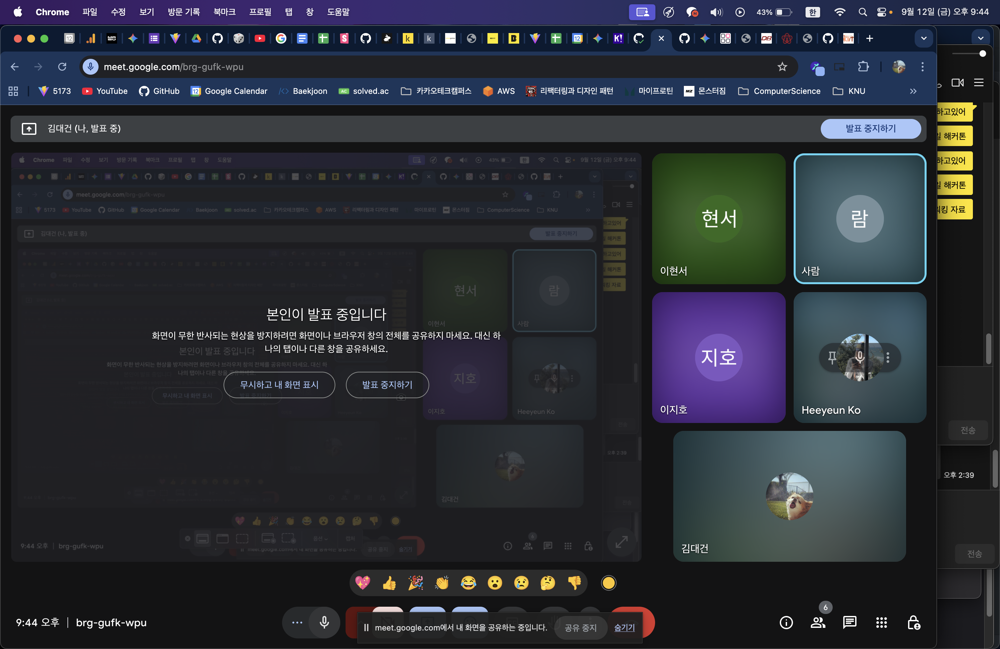

# 종합설계프로젝트2 계획발표 내용 구체화

| 개요     | 내용                                       |
| -------- | ------------------------------------------ |
| 회의주제 | 프로젝트 아이디어 구체화 및 수행 계획 논의 |
| 일시     | 2025년 9월 12일, 오후 9시                  |
| 참석자   | 김대건, 고희연, 박민진, 이지호, 이현서 외  |

## 주요 논의 내용

### 1. 진행 방향 및 문제 정의

-   문제 제기

    -   고품질 이미지 생성을 위해서는 구조화된 프롬프트가 필요하나, 일반 사용자에게는 작성 난도가 높음.
    -   일관된 화풍 재연 또한 어려움 → 이를 해결할 기능 필요.

-   서비스 타깃
    -   초기 논의에서는 일반 사용자 대상이었으나, 이번 회의에서 콘텐츠 크리에이터를 주요 타깃으로 확정.
    -   이미지뿐 아니라 영상·오디오 확장 가능성을 염두에 둠.

### 2. 논문 주제 방향

-   구조화된 프롬프트 vs 일반 프롬프트의 결과 비교

    -   동일 주제의 이미지 생성 후 품질 비교(CLIP Score, LPIPS 등 활용).
    -   논문 작성 난이도가 낮고, 단기간 내 실험 가능.

-   AI 인프라 부하 분산 아키텍처 설계 및 성능 측정

    -   ComfyUI/Flask 기반으로 모델 인퍼런스를 분리해 부하 분산.
    -   시간 제약 상 실제 운영보다는 설계 및 일부 테스트 위주로 진행.
    -   논문은 2편 동시 진행 가능성을 열어두고, 학회 제출 여부는 멘토와 추가 협의 예정.

### 3. 기술 스택 (초안)

-   프론트엔드: React, ReactFlow, Emotion, TailwindCSS
-   백엔드: Spring Boot (메인), Flask (AI API Wrapping)
-   AI: PyTorch, LoRA Fine-tuning, (필요 시) ComfyUI 컨테이너 활용
-   인프라: Kubernetes, CI/CD 파이프라인 구축

### 4. 역할 분담 (임시)

-   AI 연구/모델: 이현서
-   백엔드 & 인프라: 박민진, 이지호
-   프론트엔드 & 디자인: 김대건, 고희연
-   논문 작성: 배경·목적(고희연, 김대건), 방법·실험·결과(이현서, 박민진)

### 5. 회의 일정

-   멘토링 회의: 2주마다 1회, Zoom 활용 (사진 기록 필수).
-   팀 내부 회의: 매주 1회, 자유롭게 시간 조율 후 사진 기록.
-   추가 요청: 필요 시 카톡·노션 기록도 증거로 활용 가능.

### 6. 학회 및 논문 제출 계획

-   [한국정보과학회 (12월 개최, 제출 마감 10월 중순)](https://www.kiise.or.kr/conference/KSC/2025/)
-   [한국정보기술학회 추계 학술대회 (제주, 제출 마감 10월 31일, 온라인 발표 가능)](https://ki-it.or.kr/board/maininfo/article/265295)

### 7. 일정 및 관리

-   GitHub Project (칸반 & 로드맵) 사용.
-   스프린트는 1주 단위로 운영.
-   초기 작업 항목: 계획 발표 준비, 와이어프레임/ERD 설계, 아키텍처 시각화, 주요 기능 프로토타입.

### 8. 협업 도구

-   Notion: 자료 아카이빙, 문서·사진 공유.
-   Figma: 아키텍처 다이어그램 및 UI 설계.
-   GitHub Project: 이슈 및 스프린트 관리.

## 결정 사항

-   서비스 타깃은 콘텐츠 크리에이터.
-   논문은 프롬프트 품질 비교와 부하 분산 아키텍처 2개 주제 병행 추진.
-   기술 스택 및 역할 분담은 초안 수준으로 확정, 추후 세부 조율.
-   학회는 정보과학회·정보기술학회를 중심으로 투고 준비.
-   협업은 Notion + GitHub Project + Figma 조합으로 진행.

## 향후 계획

-   주말까지: 각자 GitHub Project에 이슈 등록.
-   9월 16일: 계획 발표용 PPT 완성 및 리허설.
-   10월 초: 논문 초안 완성, 실험 데이터 수집.
-   10월 중순~말: 학회 제출.

## Todo List

-   팀원 전체: 주말까지 GitHub 프로젝트에 각자 담당하는 이슈 생성.
-   김대건: 회의 내용을 기반으로 발표 PPT를 초안 작성하여 노션에 공유.
-   이현서: AI 구현 방안을 구체화하고, PyTorch 로고 및 관련 이미지를 찾아 공유.
-   박민진/이지호: 백엔드/인프라 기술 스택 및 구현 방안을 구체화하여 공유.
-   팀 전체: 월요일에 PPT 최종 수정 및 발표 준비.

    

        회의 진행 사진
    

        

