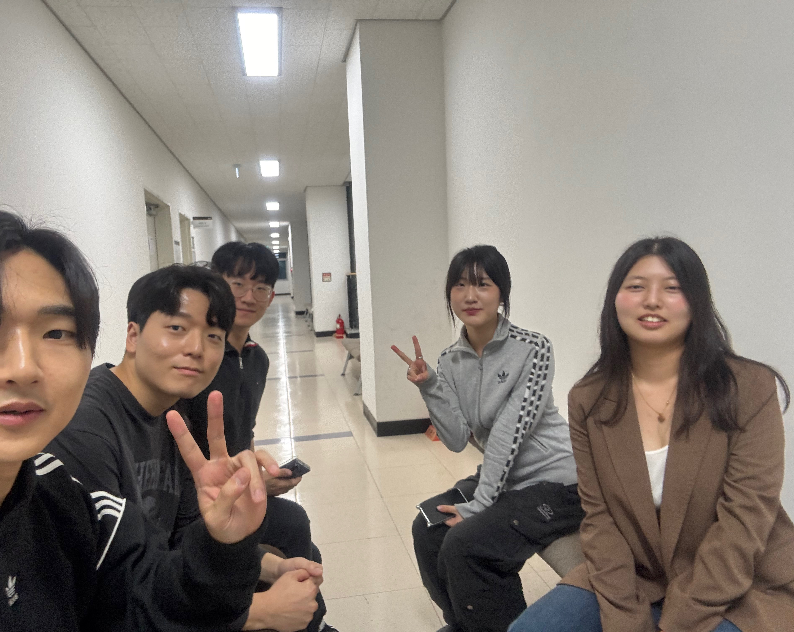

### 종합설계프로젝트2 중간발표 회의록

#### 1. 회의 개요

| 개요      | 내용                                            |
| --------- | ----------------------------------------------- |
| 회의 주제 | 중간 발표 자료 준비 및 AI/인프라 논문 계획 확정 |
| 일시      | 2025년 10월 10일 (금) 오후 9시 35분             |
| 참석자    | 김대건, 고희연, 박민진, 이지호, 이현서          |

---

#### 2. 주요 논의 내용

-   중간 발표 (10/14) 전략:

    -   발표 시간(10분 이내)이 짧으므로, 핵심 기능 및 변경된 프로젝트 방향성(노드 → 캔버스 기반)에 집중하기로 결정.
    -   발표 자료는 각자 맡은 부분을 작성 후 디자인을 입히기로 했으며, 피그마 디자인 시안을 활용하여 통일성을 확보하기로 함.
    -   시각 자료 강화: Segment Anything 모델을 활용한 마스킹 데모 영상 등 기술적인 동영상을 준비하여 발표에 활용하기로 함.

-   논문 계획 및 담당:

    -   논문 편수: 인프라 1편, AI 1편, 총 2편 작성 계획을 유지.
    -   AI 논문 (이현서): 실험을 헤비하게 넣어 논문 분량을 확보하고, 실험 결과를 중점적으로 다루기로 함.
    -   인프라 논문 (박민진, 이지호): 부하 분산과 전체 시스템 아키텍처를 담아낼 예정이며, AI 서버와 WAS 간의 통신 구조에 대한 설명을 강화하기로 함.

-   핵심 기능 구현 상세 논의 (FE ↔ AI):

    -   AI 내부 다이어그램 필요성: 고석주 교수님의 성향을 고려하여, AI 서버 내부에서 SGI2V/엔티티 인코더 등이 어떻게 동작하는지에 대한 개념 다이어그램을 PPT에 삽입하여 전문성을 어필하기로 함.
    -   주요 기능 플로우 확정:
        -   스토리보드 생성/수정: 사용자 입력 → WAS → Fast API (AI) → 이미지 생성 → WAS → FE.
        -   마스킹: FE (영역 선택) → WAS → Fast API (SAM 처리) → 마스킹된 영역 반환.
        -   영상 생성: 드래그 궤적 벡터 입력 → Fast API (SG-i2V 변환) → 비디오 반환.
    -   사용자 화풍 저장 (LoRA 파일):
        -   사용자의 화풍 가중치 파일(.safetensors)은 AWS S3에 저장하고, 이미지 생성 요청 시 WAS를 거쳐 Fast API로 전달하여 화풍을 적용하는 방식으로 진행.
        -   Fast API는 LoRA 텐서 파일을 붙여 이미지를 생성하므로, 백엔드에서 S3 연동을 통해 파일을 가져오는 로직이 필요함.

-   AI 서버 구성:
    -   Fast API 서버 내부에 AI 코드가 포함되어 있으며, WAS(Spring Boot)가 Fast API에 외주를 주는 형태로 통신하는 구조를 다시 확인.

---

#### 3. 결정 사항

-   발표 목차: 프로젝트 변경 사유 → 핵심 기능 재정의 및 플로우 → AI/클라우드 아키텍처 (와하 자료) → 논문 및 향후 일정 순으로 구성.
-   논문 주제: 인프라 논문과 AI 논문 2편 모두 10월 31일(한국정보기술학회) 제출을 목표로 집중 개발 및 작성.
-   논문 역할 분담:
    -   PPT 슬라이드: 프로젝트 변경 이유 및 목차 (고희연), 핵심 기능 및 플로우 (김대건, 이현서), 아키텍처 및 논문 계획 (박민진, 이지호).
    -   PPT 디자인: 피그마 시안 활용.

---

#### 4. 향후 계획 (Action Items)

-   김대건: 논의된 내용을 기반으로 PPT 초안 페이지 구성 및 캡션 작성 완료.
-   이현서: AI 내부 구조 다이어그램(엔티티 인코더 등) 정리 및 PPT 페이지에 삽입할 이미지 파일 공유.
-   박민진/이지호: 클라우드 아키텍처 다이어그램 및 WAS-Fast API 시퀀스 다이어그램(AI 요청, 마스킹 요청 등) 정리.
-   팀 전체: 월요일 저녁 최종 발표 자료 점검 회의를 진행하고, 화요일 발표에 임하기로 함.
-   이현서 (개인): 개인 사비를 들여 제주도 학회(10/31) 참가를 긍정적으로 고려하기로 함.

    

        회의 진행 사진
    

        

